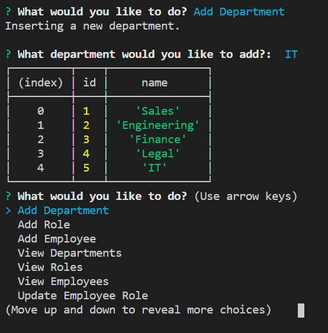

# Employee Manager
View, add, and edit a database of company departments, roles, and employees.

## Description
This program is a command line application to allow a user to have a database of information on their company and the details of it's employees and corporate structure. With this application one can add departments, roles, and employees to a table compiling the data of the company. User can also view the details of the departments, roles, and employees of the company and update the roles of employees.

## Table of Contents
* [Getting Started](#getting-started)
* [Installation](#installation)
* [Usage](#usage)
* [Author](#author)
* [Acknowledgments](#acknowledgments)
* [License](#license)

## Getting Started
* [Github Repository](https://github.com/nathanmvu/employee-manager)
* [Usage Demo Video](https://drive.google.com/file/d/14rFG7i_9Mj7pS_ROhEpMp-Ojkt3oGMvo/view)
* [Demo GIF](./Screenshots/demo.gif)

## Installation
This project uses Node.js so it will need to be installed in order to operate the application.
To install the project, download it from the Github repository. Running the program will require running:
```javascript
npm install
```
,
```javascript
npm install inquirer
```
, and 
```javascript
npm install mysql
```
in the integrated terminal. Afterwards, in the integrated terminal for the app.js file run:
```javascript
node app.js
```
and the application should begin prompting you with options regarding how to proceed with the program.

## Usage
Initial Prompt:


Adding Department:


Adding Role:


Adding Employee:

* Currently application does not account for the addition of a new manager where the manager ID would be null.

## Author
* Nathan Vu
* [Github](https://github.com/nathanmvu)
* [Email](mailto:nathanvu99@gmail.com)

## Acknowledgments
* Project parameters provided by the UCB Extension Coding Bootcamp

## License
[](https://github.com/tterb/atomic-design-ui/blob/master/LICENSEs)